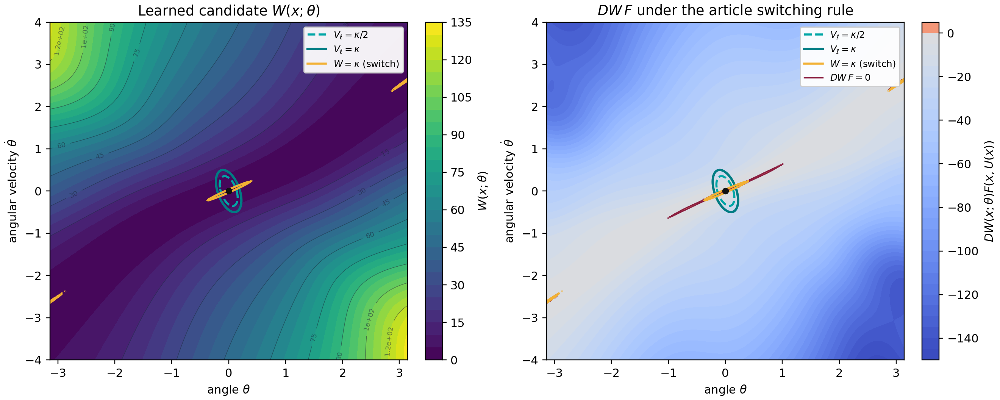

# Article version: nonlinear-pendulum stabilization

Implementation of Section V-B: the printed system, matrix `A`, networks, loss,
training domain, and switching rule. Additional numerical choices are listed
below; the run does not reconstruct the original data behind Figures 3 and 4.

## Equations implemented

The nonlinear system is

```text
x1_dot = x2
x2_dot = omega^2 sin(x1) + cos(x1) u,
```

with `omega=1` and

```text
X = [-pi, pi] x [-4, 4].
```

The linear approximation is reproduced exactly as printed:

```text
A_article = [[0, 1],
             [0, 0]],
B         = [[0],
             [1]].
```

The Jacobian of the nonlinear field is

```text
A_jacobian = [[0,       1],
              [omega^2, 0]].
```

For `omega=1`, the `(2,1)` entries differ by one. The test suite verifies this
both analytically and by centered finite differences.

The learned Lyapunov candidate follows equations (8) and (9):

```text
T_theta(x) = W2 (tanh(W1 x+b1) - tanh(b1)),
W(x;theta) = T_theta(x)^T T_theta(x).
```

The hidden layer has 32 units. The learned scalar controller has the same
zero-at-origin architecture and 20 hidden units. The pointwise loss is

```text
[D W(x) F(x,N(x)) + W(x)]_+ - [W(x)-epsilon]_-,
```

using the article's definitions `[s]_+=max(0,s)` and
`[s]_-=min(0,s)`.

## Run

After [setup](../../README.md#setup), run from the repository root:

```bash
python -m unittest example_2.article_version.test_example2
python -m example_2.article_version.example2 --outdir example_2/article_version/results/reference
```

The full CPU run uses 5,000 Adam steps. Use `--quick` for an installation check.

## Numerical choices

The article does not report `K`, `P`, `kappa`, `epsilon`, the optimizer,
learning rate, epoch count, random seed, trained weights, or whether the
uniform grid includes the boundary. These values affect the experiment and
cannot be recovered from the displayed formulas.

The reference run uses

```text
K       = [-2, -3]
P       = [[1.25, 0.25], [0.25, 0.25]]
kappa   = 0.05
epsilon = 0.1
seed    = 20260820
Adam learning rate = 1e-3
steps   = 5000
```

`K` assigns poles `-1` and `-2` to the closed-loop system formed with the
printed `A_article`. `P` solves the corresponding Lyapunov equation with
right-hand side `-I`. The remaining values are stated implementation choices,
not recovered values. The training grid uses cell midpoints. The
boundary-including `201 x 201` validation grid contains those midpoint points,
so it is a denser check but not an independent sample.

## Figures and interpretation



Separate PNG files are stored in
[`figures/reference`](figures/reference). The run also regenerates SVG versions
and the underlying compressed arrays locally. The left panel shows the learned
candidate `W`. The right panel shows its derivative under the switching rule
printed in the article. The local quadratic levels and the actual neural
switching contour are overlaid separately.

The plotted candidate is `W`. The article's control section does not specify
a formula for a combined Lyapunov function.

On the boundary-including finite grid, which overlaps the training grid:

```text
min W on X \ B_(kappa/2)                 = +0.007428679777545624
max DW F under learned control            = +0.055950975617497595
fraction with learned derivative >= 0     = 0.001141892562804091
max DV_l F under local control on B_kappa = -0.0004930743848926873
max DW F under the printed switching rule = +3.6885728651168144
fraction with switched derivative >= 0    = 0.0016089108910891088
```

The local quadratic check passes on this grid; the learned and switched
derivatives retain sign violations. Exact metrics are in
[`run_record.json`](figures/reference/run_record.json); the command above
regenerates `validation_arrays.npz` for pointwise inspection.

See [`AUDIT.md`](AUDIT.md) for the matrix discrepancy and validation limits.
