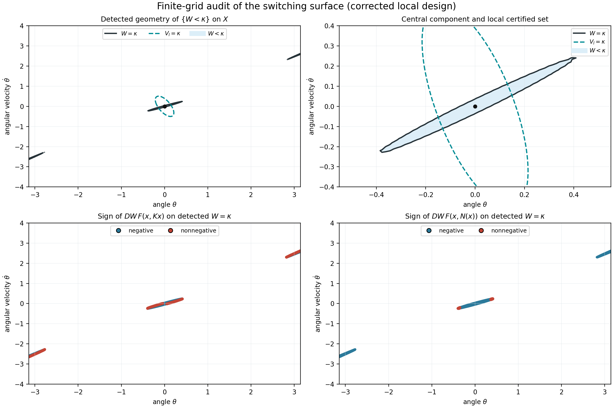

# Corrected-matrix control experiment

Controlled reruns of Section V-B with the corrected linearization. The
networks, loss, optimizer, seed, grids, and switching rule are unchanged.

The corrected Jacobian for the printed system at `omega=1` is

```text
A = [[0, 1],
     [1, 0]],
B = [[0],
     [1]].
```

Two runs are provided:

1. `matrix_only` changes only `A` and freezes the numerical `K` and `P` from
   `article_version`. The neural training pipeline does not read `A`, so this
   run is expected to reproduce the article-version numerical result exactly.
2. `consistent_local_design` keeps `K=(-2,-3)` and recomputes
   `P=[[11/6,1/2],[1/2,1/3]]`, giving
   `(A+BK)^T P + P(A+BK)=-I`. This changes the local level sets used to select
   training points and to validate the local branch, but changes nothing else.

After [setup](../../README.md#setup), run from the repository root:

```bash
python -m unittest example_2.corrected_matrix.test_example2
python -m example_2.corrected_matrix.example2 --outdir example_2/corrected_matrix/results/reference
```

The output contains separate records and figures for both runs.

## Switching-surface audit

To evaluate the switching surface `W=kappa`:

```bash
python -m example_2.corrected_matrix.invariance_audit
```

This command detects every `W=kappa` component visible on a marching-squares
grid, refines the contour points with the network gradient, evaluates `DW F`
under both controls, checks the sampled topology of `{W<kappa}`, and saves the
model weights required to reproduce the audit. It remains a finite-grid
check. For a resolution check using the same saved weights, pass
`--model-state` and a new odd `--contour-grid`.

The committed `2001 x 2001` reference audit can be reproduced without
retraining:

```bash
python -m example_2.corrected_matrix.invariance_audit \
  --model-state example_2/corrected_matrix/figures/reference/invariance_audit/model_state.pt \
  --contour-grid 2001 \
  --outdir example_2/corrected_matrix/results/invariance_audit_2001
```

Its figure and numerical record are stored in
`figures/reference/invariance_audit/`.



## Exploratory diagnostics

Controller-domain alignment:

```bash
python -m example_2.corrected_matrix.switching_audit
```

For the printed switch to use each controller only on its checked domain, the
sampled sets would need to satisfy

```text
B_(kappa/2) subset {W < kappa} subset B_kappa.
```

The audit also evaluates the direct rule `V_l <= kappa`. This rule aligns the
controller domains by construction, but it is not presented as a completed
Lyapunov gluing: continuity and decrease across the switching boundary still
have to be established.

The boundary-matching experiment adds a penalty for `W=kappa` on sampled
points of the ellipse `V_l=kappa`. This condition and its weight are additions
to the article's method:

```bash
python -m example_2.corrected_matrix.boundary_matching --weight 1
```

The record reports the original loss and the boundary residual separately.

Results and limitations are in [`AUDIT.md`](AUDIT.md).
