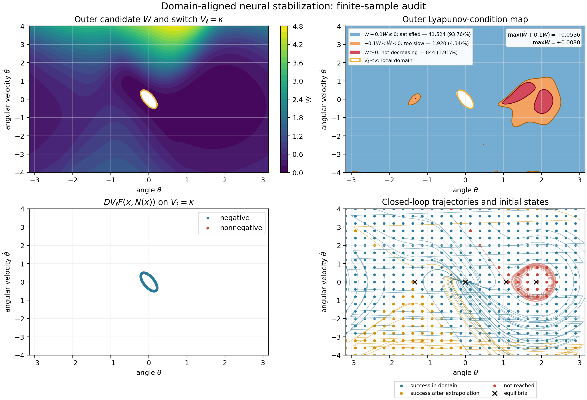

# Domain-aligned improvement of Example 2

This version keeps the two-controller construction of Section IV-B but makes
the controller domains explicit:

```text
u(x) = Kx     if V_l(x) <= kappa,
       N(x)   if V_l(x) >  kappa.
```

The local controller is therefore used exactly on the set where its local
Lyapunov inequality is checked. The outer controller is trained on the
complement. On `V_l=kappa`, training additionally penalizes an outward vector
field and a jump between `N(x)` and `Kx`.

The neural inputs are

```text
(sin(theta), 1-cos(theta), theta_dot/4),
```

so the learned candidate and control are exactly periodic in the angle. The
candidate retains the article's nonnegative form `W=T^T T` and both neural
maps remain exactly zero at the target.

Run from the repository root:

```bash
python -m unittest example_2.improved.test_example2
python -m example_2.improved.example2 \
  --outdir example_2/improved/results/reference
```

The run saves the trained weights, the independent validation arrays, the
trajectory arrays, a numerical record, and a four-panel audit figure.

The committed reference weights, record, and figure are in
`figures/reference/`.



The result is a finite-sample local-stabilization experiment. It is not
described as a global Lyapunov certificate; the mathematical obstruction and
the empirical region-of-attraction result are documented in
[`AUDIT.md`](AUDIT.md).
