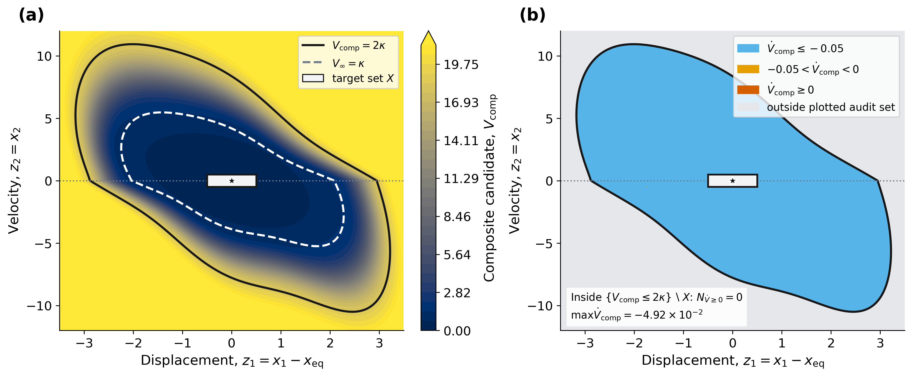
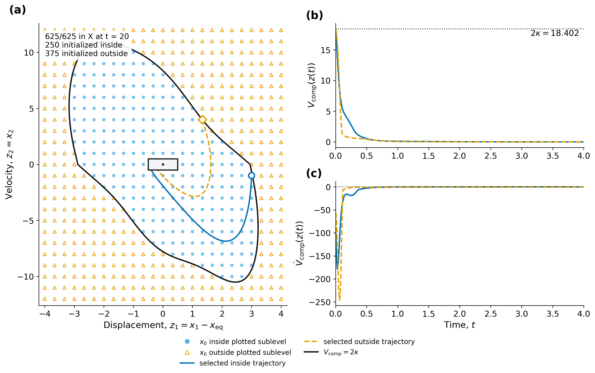
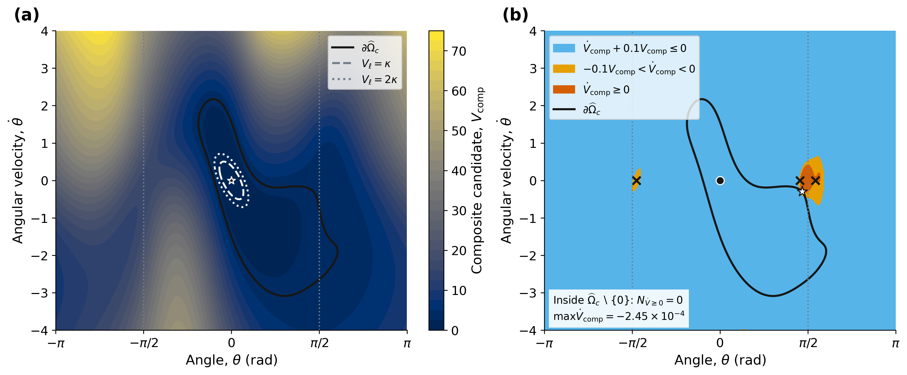
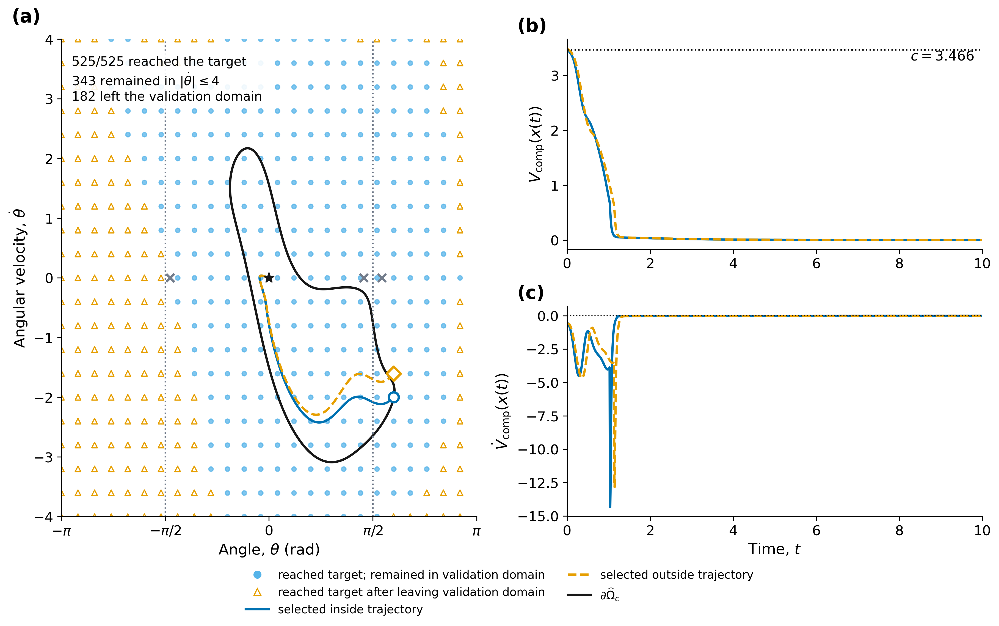
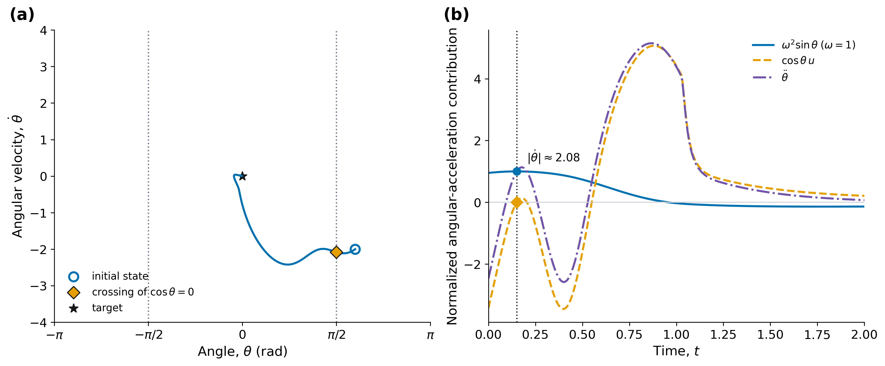

# Checkpoint reproduction

```bash
python reproduction/reproduce.py --outdir results/reproduced
```

Run from the repository root after installing `requirements.txt`, or use
`START.cmd` on Windows. The command loads preserved weights, recalculates
validation grids and trajectories, and saves five PNG/SVG figures, numerical
arrays, and `verification.json`. It does not train networks. The output
directory must be new; a failed numerical check returns a nonzero exit code.

## Checkpoints and results

| | Example 1 | Example 2 |
| --- | --- | --- |
| Checkpoint source | `d87c896`, unchanged in subsequent main snapshots | `d22b775` |
| Sublevel | 2 kappa = 18.4021614192 | c = 3.466 |
| Trajectory grid | 25 x 25 over [-4,4] x [-12,12] | 25 x 21 over [-pi,pi) x [-4,4] |
| RK4 step / horizon | 0.01 / 20 | 0.01 / 40 |
| Final target count | 625/625 in X | 525/525 at the target tolerance |
| Initial states inside/outside the plotted sublevel | 250/375 | See verification record |
| Trajectories staying/leaving the validation velocity range | — | 343/182 |

Example 1 loads `example_1/improved/figures/reference/models.pt`.
Example 2 loads `checkpoints/example2-d22b775/model_state.pt`; its original
record and figures are preserved alongside it. `checkpoints/SHA256.json`
pins both model files, and `SOURCE.json` identifies the recovered Git objects.
The existing improved implementations supply the equations and audit routines.

The later Example 2 checkpoint under `example_2/improved/figures/reference/`
gives c=3.436 and 344/181 trajectories staying/leaving the validation domain.
The repository's [summary tables](../publication/reference/reproducibility_summary.md)
describe that later run. It has not been replaced.

## Numerical checks

Example 1's independent mixed-grid audit reproduces the stored maximum
derivative, -0.0441434656. Its displayed composite sublevel is checked on
401 x 401 cell midpoints over [-3.5,3.5] x [-12,12], giving -0.0491804.
The earlier rendering reported -0.0428; its exact display grid is unavailable,
so that particular extremum is not reproduced exactly. Additional 801 and
1201 non-nested grids give -0.0441124 and -0.0459027, with no nonnegative
derivatives; see [grid sensitivity](grid_sensitivity.json).

Example 2 uses both 401 x 401 and 801 x 801 validation grids. Its maximum
derivative in the sampled origin component, excluding the target, is
-0.000245460792 on the first grid. Both grids have zero nonnegative derivatives
in that component. The selected trajectory crosses theta=pi/2 at speed 2.08133.
The selected curves in both examples use RK4 step 0.005.

All annotations are calculated from the arrays. These finite-grid and
finite-horizon observations are not continuous-domain certificates.
The [verification record](reference/verification.json) contains parameters,
checksums, environment details, and the full numerical results.

## Figures










